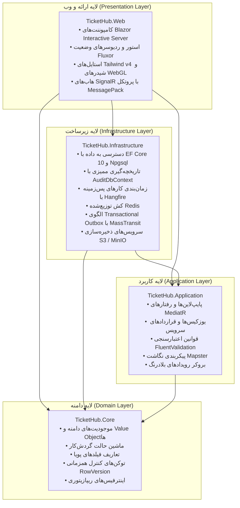
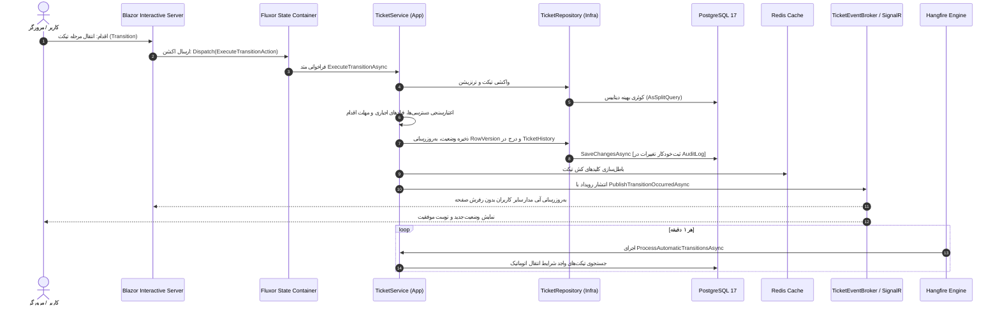

# سامانه مدیریت تیکت و گردش‌کار سازمانی TicketHub 🚀

> **پلتفرم پیشرفته و بلادرنگ مدیریت تیکت‌ها، اتوماسیون گردش‌کارهای سازمانی و پایش مهلت اقدام (SLA)**  
> توسعه‌یافته با **.NET 10**، معماری تمیز (**Clean Architecture**)، **Blazor Interactive Server** و رابط کاربری تاکتیکال سایبری همراه با **شیدرهای پردازش ابری WebGL**.

[](https://dotnet.microsoft.com/)
[](https://dotnet.microsoft.com/apps/aspnet/web-apps/blazor)
[](https://www.postgresql.org/)
[](https://tailwindcss.com/)
[](https://github.com/mrpmorris/Fluxor)
[](https://www.hangfire.io/)
[](https://redis.io/)
[](https://www.docker.com/)
[](https://ticket.xnario.ir)
[](TicketHub.Tests.bUnit)
[](LICENSE)

---

🌐 **زبان‌ها / Language:**  
[**English Documentation (نسخه انگلیسی)**](README.md) | **فارسی** | [**🌐 دموی آنلاین سامانه**](https://ticket.xnario.ir)

---

## 📑 فهرست مطالب

- [معرفی کلی سامانه](#-معرفی-کلی-سامانه)
- [ویژگی‌ها و قابلیت‌های برجسته](#-ویژگیها-و-قابلیتهای-برجسته)
- [معماری و تفکیک لایه‌ها](#-معماری-و-تفکیک-لایهها)
- [جریان داده و چرخه رویدادها](#-جریان-داده-و-چرخه-رویدادها)
- [استک فناوری‌های به‌کار‌رفته](#-استک-فناوریهای-بهکاررفته)
- [راهنمای راه‌اندازی سریع](#-راهنمای-راهاندازی-سریع)
  - [پیش‌نیازها](#پیشنیازها)
  - [اجرا از طریق داکر (روش پیشنهادی)](#اجرا-از-طریق-داکر-روش-پیشنهادی)
  - [اجرای محلی از روی سورس‌کد](#اجرای-محلی-از-روی-سورس‌کد)
- [تنظیمات متغیرهای محیطی](#-تنظیمات-متغیرهای-محیطی)
- [تست‌های خودکار و تضمین کیفیت](#-تستهای-خودکار-و-تضمین-کیفیت)
- [مستندات تکمیلی و پیوندها](#-مستندات-تکمیلی-و-پیوندها)
- [مجوز استفاده (لایسنس)](#-مجوز-استفاده-لایسنس)

---

## 🌟 معرفی کلی سامانه

**TicketHub** یک سامانه تیکتینگ سازمانی مدرن و با کارایی بالاست که برای پر کردن شکاف میان سیستم‌های کند و سنتی اداری و رابط‌های کاربری بلادرنگ گیمینگ و تاکتیکال طراحی شده است.
این سامانه با تکیه بر معماری پاک (**Clean Architecture**) در لایه بک‌اند با **.NET 10** و ارائه رابط کاربری بلادرنگ با **Blazor Interactive Server** و **SignalR**، بستری فوق‌سریع و بدون نیاز به رفرش صفحه برای ثبت، پیگیری، تغییر وضعیت و اتوماسیون تیکت‌ها به همراه پشتیبانی بومی از تقویم جلالی (شمسی) و زبان فارسی فراهم کرده است.

> 🌐 **آدرس استقرار و دموی آنلاین:** [https://ticket.xnario.ir](https://ticket.xnario.ir)  
> 🔑 **دسترسی حساب کاربری مهمان:** برای بررسی و تجربه سامانه، می‌توانید با نام‌کاربری `guest` (یا `guest@tickethub.io`) و رمز عبور `guest` (نقش «کاربر» / مشتری) وارد شوید.

---

## ⚡ ویژگی‌ها و قابلیت‌های برجسته

### 🔄 ۱. موتور گردش‌کار پویا و بوم بصری درگ‌اند‌دراپ (Visual Workflow Canvas)
- **ویرایشگر دیاگرام اختصاصی:** محیط گرافیکی کامل (`WorkflowEditor`) برای ترسیم فلوچارت‌های گردش‌کار، تعریف گره‌های وضعیت و اتصال درگاه‌ها (`Top`, `Bottom`, `Left`, `Right`).
- **کنترل دسترسی در سطح ترنزیشن:** تخصیص نقش‌های مجاز (`TransitionRole`) برای هر انتقال وضعیت و تعریف فیلدهای اجباری مرحله (`TransitionField`).
- **پایش مهلت اقدام و SLA:** محاسبه خودکار مهلت اقدام برای هر تیکت و اعمال انتقال‌های خودکار توسط کارهای پس‌زمینه Hangfire.

### 📝 ۲. موتور فیلدهای پویای چندگانه (Dynamic Custom Fields)
- امکان تعریف فیلدهای اختصاصی برای پروژه‌ها و دسته‌بندی‌ها **بدون نیاز به اعمال مایگریشن در دیتابیس**.
- پشتیبانی از ۹ نوع فیلد متنوع: متنی، متن طولانی، عددی صحیح، اعشاری، بولین (چک‌باکس)، تاریخ، تک‌انتخابی، چندانتخابی و آپلود فایل.

### 🎮 ۳. رابط کاربری سایبری (Cyber Cockpit HUD) و شیدرهای GPU WebGL
- **تم تاریک کریستالی (Dark Obsidian Glass):** برش‌های هندسی ۴۵ درجه، نشانگرهای وضعیت نئونی و طراحی سازگار با کنتراست بالا بر پایه Tailwind CSS v4.
- **شیدرهای Procedural GLSL:** شبیه‌سازی سیالات و فیزیک طبیعی (آتش حجمی FBM، قوس‌های پلاسمای ولتاژ بالا، امواج شفاف اقیانوسی و دود اسیدی) با سخت‌افزار کارت گرافیک از طریق `gamer-hud.js`.
- **بهینه‌سازی حداکثری مصرف پردازنده و باتری:** توقف خودکار رندرهای WebGL در صورت خروج کارت از محدوده دید (`IntersectionObserver`) یا سوئیچ کاربر به تبی دیگر (Page Visibility API).

### 🔍 ۴. جستجوی تمام‌متن شتاب‌یافته در PostgreSQL (Full-Text Search)
- ساخت ستون بردار متنی با ایندکس معکوس **GIN** روی عنوان و متن تیکت‌ها جهت اجرای کوئری‌های متنی سریع در کمتر از چند میلی‌ثانیه.

### ⚡ ۵. همگام‌سازی بلادرنگ و واکنشی (Real-Time Synchronization)
- ارتباط بلادرنگ پایدار از طریق **SignalR** با پروتکل باینری فشرده **MessagePack**.
- انتشار رویدادها از طریق بروکر درون‌برنامه‌ای `TicketEventBroker` جهت به‌روزرسانی آنی مدار تمام کلاینت‌های متصل بدون نیاز به رفرش صفحه.

### 🔒 ۶. امنیت سازمانی، احراز هویت و سیستم ممیزی (Audit Trail)
- پشتیبانی از ورود یکپارچه سازمانی (**SSO**) مبتنی بر پروتکل **OpenID Connect (OIDC)** با قابلیت ایجاد خودکار کاربر (Auto-Provisioning).
- احراز هویت کوکی امن با رمزنگاری کلیدها در DataProtection.
- **سپر دفاعی در برابر بروت‌فورس:** کپچای عددی فارسی (`DNTCaptcha`) و سیاست‌های نرخ درخواست (Rate Limiting).
- **لاگ ممیزی کامل:** رهگیری خودکار تمام تغییرات جداول (شناسه کاربر، مقادیر قبلی و جدید JSON و زمان UTC) با استفاده از `Audit.EntityFramework.Core`.

### 📦 ۷. مدیریت چندگانه فایل‌ها و پیام‌رسانی پایدار
- قابلیت سوییچ بدون تغییر کد میان درایور دیسک محلی و سرویس ابری سازگار با S3 (**MinIO / AWS S3**).
- پیاده‌سازی الگوی مطمئن **Transactional Outbox** با `MassTransit` برای تضمین تحویل رویدادها و ایمیل‌ها.

---

## 🏛️ معماری و تفکیک لایه‌ها

معماری سامانه TicketHub کاملاً منطبق بر اصول **Clean Architecture (Onion Architecture)** تفکیک شده است:



- **[TicketHub.Core](TicketHub.Core):** حاوی موجودیت‌های تجاری (`Ticket`, `Workflow`, `Transition`, `TicketField`, `User`, `Role`, `AuditLog`)، بدون هیچ‌گونه وابستگی به فریم‌ورک‌های خارجی وب.
- **[TicketHub.Application](TicketHub.Application):** شامل منطق کسب‌وکار، DTOها، پایپ‌لاین‌های اعتبارسنجی، لاگینگ (`LoggingBehavior`)، کشینگ (`CachingBehavior`) و اینترفیس‌های ارتباطی.
- **[TicketHub.Infrastructure](TicketHub.Infrastructure):** مدیریت دیتابیس، مایگریشن‌ها، کار با `IDbContextFactory` برای تضمین ایمنی در سناریوهای چندنخی Blazor Server، سیستم ذخیره‌سازی فایل، ردیس و موتور هنگ‌فایر.
- **[TicketHub.Web](TicketHub.Web):** کلاینت واکنشی Blazor Server، مدیریت جریان وضعیت با Fluxor، کامپوننت‌های جنریک چندمنظوره (`DataGrid<T>`)، تقویم جلالی و چک‌های سلامت سیستم.

---

## 🔄 جریان داده و چرخه رویدادها



---

## 🛠️ استک فناوری‌های به‌کار‌رفته

| فناوری / ابزار | نقش در پروژه | نسخه |
|---|---|:---:|
| **.NET** | فریم‌ورک پایه و زبان C# | `10.0` |
| **Blazor Web App** | لایه فرانت‌اند بلادرنگ (Interactive Server) | `10.0` |
| **Fluxor** | مدیریت جریان تک‌مسیره وضعیت (Redux-style) | `6.11.0` |
| **Tailwind CSS** | استایل‌دهی و طراحی گلس‌مورفیسم ابسیدین | `4.x` (CLI اختصاصی) |
| **WebGL / GLSL** | شیدرهای GPU برای افکت‌های بصری | Native |
| **PostgreSQL** | پایگاه‌داده رابطه‌ای اصلی | `17` |
| **Entity Framework Core** | نگاشت شیء-رابطه‌ای و مایگریشن‌ها (`Npgsql`) | `10.0.10` |
| **Audit.NET** | رهگیری عمیق تغییرات موجودیت‌ها | `32.2.0` |
| **Redis** | کش توزیع‌شده سطح ۲ | `10.0.10` (`StackExchange.Redis`) |
| **Hangfire** | زمان‌بندی و مدیریت کارهای پس‌زمینه | `1.8.18` / `1.21.1` (PostgreSQL) |
| **MassTransit** | پیام‌رسانی غیرهمگام و Transactional Outbox | `8.3.6` |
| **MinIO / AWS S3** | ذخیره‌سازی ابری پیوست‌ها | `4.0.102.4` (`AWSSDK.S3`) |
| **SignalR** | ارتباط دوطرفه بلادرنگ با MessagePack | `10.0.11` |
| **FluentValidation** | اعتبارسنجی ساختاریافته مدل‌ها و DTOها | `12.1.1` |
| **Mapster** | مپینگ اشیاء با کارایی بالا بدون Reflection | `10.0.11` |
| **bUnit & xUnit** | فریم‌ورک تست کامپوننت و تست واحد | `2.9.0` / `2.9.3` |
| **Playwright** | تست‌های انتها‌به‌انتها روی مرورگر | `1.61.0` |
| **Testcontainers** | ایجاد کانتینرهای موقت دیتابیس برای تست | `4.13.0` |

---

## 🚀 راهنمای راه‌اندازی سریع

### پیش‌نیازها
- نصب [.NET 10.0 SDK](https://dotnet.microsoft.com/download/dotnet/10.0) یا بالاتر
- نصب [Docker](https://www.docker.com/) و [Docker Compose](https://docs.docker.com/compose/)
- ابزار کنترل نسخه [Git](https://git-scm.com/)

---

### اجرا از طریق داکر (روش پیشنهادی)

1. **کلون کردن ریپازیتوری:**
   ```bash
   git clone https://github.com/AliOraei78/TicketHub.git
   cd TicketHub
   ```

2. **تنظیم فایل متغیرهای محیطی:**
   یک کپی از فایل نمونه ایجاد کنید:
   ```bash
   cp .env.example .env
   ```
   *(در صورت نیاز، رمزها و تنظیمات داخل `.env` را تغییر دهید).*

3. **اجرای تمامی سرویس‌ها با داکر کامپوز:**
   ```bash
   docker compose up -d
   ```

4. **دسترسی به سرویس‌ها:**
   - **رابط کاربری TicketHub:** آدرس `http://localhost:5000`
   - **کنسول مدیریت فضای ذخیره‌سازی MinIO:** آدرس `http://localhost:9001`
   - **بررسی سلامت سیستم (Health Checks):** آدرس `http://localhost:5000/health`

---

### اجرای محلی از روی سورس‌کد

1. **روشن کردن کانتینرهای دیتابیس و سرویس‌های کمکی:**
   ```bash
   docker compose up -d postgres redis minio
   ```

2. **بازیابی پکیج‌ها و کامپایل پروژه:**
   ```bash
   dotnet restore
   dotnet build
   ```

3. **اعمال مایگریشن‌های پایگاه‌داده:**
   ```bash
   dotnet ef database update --project TicketHub.Infrastructure --startup-project TicketHub.Web
   ```

4. **اجرای برنامه وب:**
   ```bash
   dotnet run --project TicketHub.Web
   ```

---

## ⚙️ تنظیمات متغیرهای محیطی

پارامترهای کلیدی پیکربندی پروژه (قابل تنظیم در فایل `.env` یا `appsettings.json`):

| متغیر | شرح کاربرد | مقدار پیش‌فرض |
|---|---|:---:|
| `DB_PASSWORD` | کلمه عبور دیتابیس PostgreSQL | `Password123!` |
| `DB_PORT` | پورت هاست دیتابیس PostgreSQL | `5432` |
| `REDIS_PORT` | پورت اتصال به سرور Redis | `6379` |
| `APP_PORT` | پورت انتشار برنامه وب TicketHub | `5000` |
| `STORAGE_PROVIDER` | ارائه‌دهنده ذخیره‌سازی پیوست‌ها (`Local` یا `MinIO` / `S3`) | `Local` |
| `STORAGE_ENDPOINT` | آدرس سرور S3 یا MinIO | `http://minio:9000` |
| `STORAGE_BUCKET` | نام باکت ذخیره‌سازی فایل‌ها | `tickethub-attachments` |
| `SSO_ENABLED` | فعال‌سازی ورود یکپارچه سازمانی (OIDC) | `false` |
| `SSO_AUTHORITY` | آدرس ارائه‌دهنده هویت سازمانی (Keycloak, Entra, Okta) | `""` |
| `SSO_CLIENT_ID` | شناسه کلاینت OIDC سازمانی | `""` |
| `SSO_AUTO_PROVISION` | ایجاد خودکار حساب کاربری در اولین لاگین SSO | `true` |

---

## 🧪 تست‌های خودکار و تضمین کیفیت

پروژه TicketHub دارای بیش از ۹۰ سوئیت تست خودکار در دو سطح است:

### ۱. تست‌های واحد و کامپوننتی bUnit (بیش از ۷۰ سوئیت)
آزمون عملکرد دقیق رندر کامپوننت‌های Blazor، انتقالات استور Fluxor، پایپ‌لاین‌های MediatR و قواعد پایگاه‌داده:
```bash
dotnet test TicketHub.Tests.bUnit/TicketHub.Tests.bUnit.csproj
```

### ۲. تست‌های انتها‌به‌انتها با Playwright (بیش از ۲۰ سوئیت)
آزمون جریان‌های واقعی کاربر روی مرورگرهای استاندارد با ایجاد کانتینرهای ایزوله و موقت PostgreSQL توسط **Testcontainers**:
```bash
dotnet test TicketHub.Tests.E2E/TicketHub.Tests.E2E.csproj
```

### ۳. استخراج گزارش یکپارچه پوشش کد (Code Coverage)
اجرای خودکار تمامی تست‌ها و تولید خروجی بصری HTML:
```powershell
# در ویندوز با PowerShell:
.\generate-coverage.ps1

# در لینوکس / مک با Bash:
./generate-coverage.sh
```

---

## 📚 مستندات تکمیلی و پیوندها

- 📋 **مشخصات محصول، پرسونای کاربران و اصول طراحی:** [PRODUCT.md](PRODUCT.md)
- 📝 **یادداشت‌های معماری و تصمیمات فنی:** [Notes.md](Notes.md)
- 🗺️ **لاگ تاریخچه و روند گام‌به‌گام توسعه:** [Journey.md](Journey.md)
- 🔍 **گزارش تخصصی نقد و تحلیل کدبیس:** [.analyses/architecture-and-tech-stack-analysis.md](.analyses/architecture-and-tech-stack-analysis.md)

---

## 📄 مجوز استفاده (لایسنس)

این پروژه تحت مجوز [MIT License](LICENSE) منتشر شده است.
