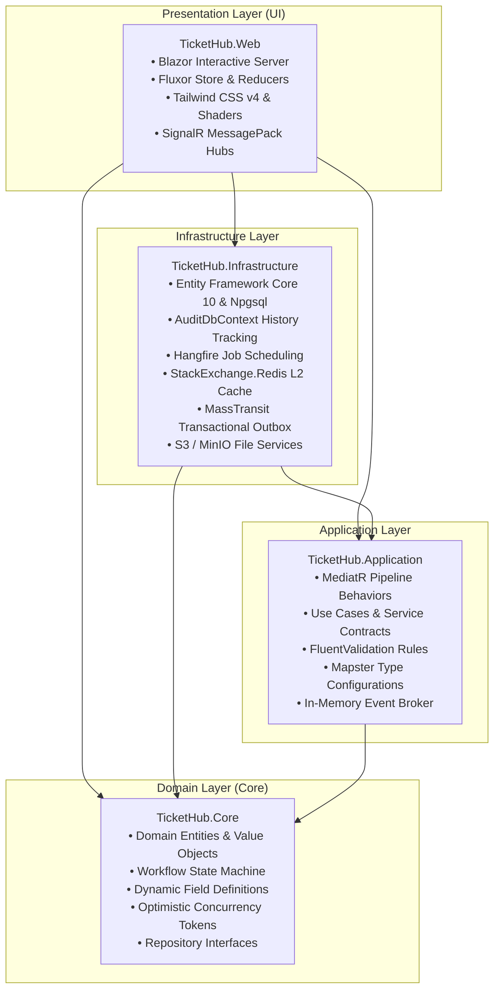
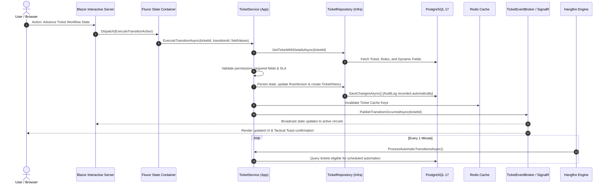

# TicketHub 🚀

> **Next-Generation Real-Time Enterprise Ticketing & Dynamic Workflow Automation Platform**  
> Built with **.NET 10**, **Blazor Interactive Server**, **Clean Architecture**, and a **Tactical Cyber Cockpit HUD with GPU WebGL Shaders**.

[](https://dotnet.microsoft.com/)
[](https://dotnet.microsoft.com/apps/aspnet/web-apps/blazor)
[](https://www.postgresql.org/)
[](https://tailwindcss.com/)
[](https://github.com/mrpmorris/Fluxor)
[](https://www.hangfire.io/)
[](https://redis.io/)
[](https://www.docker.com/)
[](https://ticket.xnario.ir)
[](TicketHub.Tests.bUnit)
[](LICENSE)

---

🌐 **Language / زبان‌ها:**  
**English** | [**فارسی (Persian Documentation)**](README.fa.md) | [**🌐 Live Demo**](https://ticket.xnario.ir)

---

## 📑 Table of Contents

- [Overview](#-overview)
- [Key Features](#-key-features)
- [Architecture & Layers](#-architecture--layers)
- [System Data Flow](#-system-data-flow)
- [Technology Stack](#-technology-stack)
- [Getting Started](#-getting-started)
  - [Prerequisites](#prerequisites)
  - [Run via Docker Compose (Recommended)](#run-via-docker-compose-recommended)
  - [Run Locally from Source](#run-locally-from-source)
- [Environment Configuration](#-environment-configuration)
- [Automated Testing & Quality](#-automated-testing--quality)
- [Documentation & References](#-documentation--references)
- [License](#-license)

---

## 🌟 Overview

**TicketHub** bridges the gap between traditional enterprise issue tracking and modern real-time gaming-grade interfaces. By combining an uncompromising **Clean Architecture** backend in **.NET 10** with **Blazor Interactive Server**, **SignalR**, and a **Cyber Cockpit HUD powered by GLSL WebGL Shaders**, TicketHub delivers zero-latency ticket collaboration, automated workflow state transitions, and SLA enforcement without horizontal scrolling or jarring page refreshes.

> 🌐 **Live Demo & Deployment:** [https://ticket.xnario.ir](https://ticket.xnario.ir)  
> 🔑 **Guest Access:** You can explore the platform using username `guest` (or `guest@tickethub.io`) and password `guest`.

---

## ⚡ Key Features

### 🔄 1. Dynamic Workflow Engine & Visual Drag-and-Drop Canvas
- **Custom Visual Editor:** Built-in graphical node editor (`WorkflowEditor`) allowing drag-and-drop workflow authoring with custom ports (`Top`, `Bottom`, `Left`, `Right`).
- **Granular Transition Controls:** Bind specific transitions to system roles (`TransitionRole`) and enforce stage-specific mandatory inputs (`TransitionField`).
- **SLA & Deadline Enforcement:** Automatic time-based transitions and SLA deadline breach checks executed via recurring background jobs.

### 📝 2. Dynamic Custom Fields Engine
- Attach project- or category-specific fields dynamically **without executing database schema migrations**.
- Supports 9 distinct field types: Text, Long Text, Integer, Decimal, Boolean, DateTime, Single Select, Multi-Select, and File Uploads.

### 🎮 3. Tactical Cyber HUD & GPU WebGL Shaders
- **Obsidian Dark Theme:** 45-degree chamfered geometry, neon status indicators, and glassmorphism styling built with Tailwind CSS v4.
- **Cinematic GLSL Shaders:** Hardware-accelerated fluid simulations (Volumetric Fire with Blackbody radiation, High-Voltage Plasma Lightning, Ocean Caustic waves, Toxic Acid fumes) via `gamer-hud.js`.
- **Zero Idle Battery Drain:** Features automated `IntersectionObserver` viewport culling and page visibility sleep mode when switching browser tabs.

### 🔍 4. Hardware-Accelerated PostgreSQL Full-Text Search
- Employs PostgreSQL `tsvector` with inverted **GIN indexes** (`SearchVector`) on tickets for sub-millisecond full-text multi-word queries.

### ⚡ 5. Real-Time Reactive Synchronization
- Single-duplex **SignalR** streaming using the compact **MessagePack** binary protocol.
- In-process `TicketEventBroker` ensures immediate state reflection across all active Blazor client circuits without manual page reloading.

### 🔒 6. Enterprise Identity, Security & Auditing
- Multi-scheme authentication: Secure encrypted Cookie Authentication alongside **OpenID Connect (OIDC)** Single Sign-On (SSO) with auto-provisioning.
- **Anti-Brute Force Protection:** Persian/English visual captcha (`DNTCaptcha`) and rate-limiting policies on authentication endpoints.
- **Full Historical Audit Trail:** Powered by `Audit.EntityFramework.Core`, capturing every entity mutation (user ID, old JSON values, new JSON values, UTC timestamp).

### 📦 7. Resilient Storage & Messaging
- **Dual-Storage Provider:** Transparent switching between local filesystem storage and S3-compatible cloud storage (MinIO / AWS S3).
- **Transactional Outbox Pattern:** Integrated with `MassTransit` and `EntityFrameworkCore` to guarantee reliable asynchronous event publishing and email delivery.

---

## 🏛️ Architecture & Layers

TicketHub is strictly organized around the principles of **Clean Architecture (Onion Architecture)**:



- **[TicketHub.Core](TicketHub.Core):** Contains core business entities (`Ticket`, `Workflow`, `Transition`, `TicketField`, `User`, `Role`, `AuditLog`). Zero dependencies on external application frameworks.
- **[TicketHub.Application](TicketHub.Application):** Encapsulates business logic, DTOs, CQRS behaviors (`LoggingBehavior`, `CachingBehavior`), validations, and service contracts.
- **[TicketHub.Infrastructure](TicketHub.Infrastructure):** Implements data access, migrations, repository patterns with `IDbContextFactory` to prevent thread concurrency issues in Blazor circuits, S3 storage, Redis caching, and Hangfire recurring jobs.
- **[TicketHub.Web](TicketHub.Web):** Blazor Server UI with Fluxor state containers, reusable templated components (`DataGrid<T>`), Persian Jalali date picker, and health checks.

---

## 🔄 System Data Flow



---

## 🛠️ Technology Stack

| Technology | Role | Version |
|---|---|:---:|
| **.NET** | Core Runtime & Language (C#) | `10.0` |
| **Blazor Web App** | Real-time interactive frontend | `10.0` (Interactive Server) |
| **Fluxor** | Unidirectional Redux state store | `6.11.0` |
| **Tailwind CSS** | Styling, Obsidian Dark Glassmorphism | `4.x` (Standalone CLI) |
| **WebGL / GLSL** | GPU-accelerated shader simulations | Native |
| **PostgreSQL** | Primary Relational Database | `17` |
| **Entity Framework Core** | ORM & Migrations (`Npgsql`) | `10.0.10` |
| **Audit.NET** | Entity mutation tracking & auditing | `32.2.0` |
| **Redis** | Distributed L2 caching | `10.0.10` (`StackExchange.Redis`) |
| **Hangfire** | Distributed background task runner | `1.8.18` / `1.21.1` (PostgreSQL) |
| **MassTransit** | Messaging & Transactional Outbox | `8.3.6` |
| **MinIO / AWS S3** | Object storage for attachments | `4.0.102.4` (`AWSSDK.S3`) |
| **SignalR** | Real-time bi-directional messaging | `10.0.11` (MessagePack protocol) |
| **FluentValidation** | Declarative DTO and model validation | `12.1.1` |
| **Mapster** | High-performance object-to-object mapping | `10.0.11` |
| **bUnit & xUnit** | Component & unit test framework | `2.9.0` / `2.9.3` |
| **Playwright** | Browser-driven End-to-End testing | `1.61.0` |
| **Testcontainers** | Disposable PostgreSQL containers for tests | `4.13.0` |

---

## 🚀 Getting Started

### Prerequisites
- [.NET 10.0 SDK](https://dotnet.microsoft.com/download/dotnet/10.0) or higher
- [Docker](https://www.docker.com/) and [Docker Compose](https://docs.docker.com/compose/)
- [Git](https://git-scm.com/)

---

### Run via Docker Compose (Recommended)

1. **Clone the repository:**
   ```bash
   git clone https://github.com/AliOraei78/TicketHub.git
   cd TicketHub
   ```

2. **Configure environment variables:**
   Copy the example environment configuration:
   ```bash
   cp .env.example .env
   ```
   *(Review and update passwords/secrets in `.env` as required).*

3. **Spin up all services:**
   ```bash
   docker compose up -d
   ```

4. **Access the application:**
   - **TicketHub Web UI:** `http://localhost:5000`
   - **MinIO Storage Console:** `http://localhost:9001`
   - **Health Checks:** `http://localhost:5000/health`

---

### Run Locally from Source

1. **Start database and supporting containers:**
   ```bash
   docker compose up -d postgres redis minio
   ```

2. **Restore dependencies & build:**
   ```bash
   dotnet restore
   dotnet build
   ```

3. **Apply database migrations:**
   ```bash
   dotnet ef database update --project TicketHub.Infrastructure --startup-project TicketHub.Web
   ```

4. **Launch the web application:**
   ```bash
   dotnet run --project TicketHub.Web
   ```

---

## ⚙️ Environment Configuration

Key configuration parameters (managed via `.env` or `appsettings.json`):

| Variable | Description | Default |
|---|---|:---:|
| `DB_PASSWORD` | PostgreSQL master password | `Password123!` |
| `DB_PORT` | PostgreSQL host bind port | `5432` |
| `REDIS_PORT` | Redis host bind port | `6379` |
| `APP_PORT` | TicketHub Web published port | `5000` |
| `STORAGE_PROVIDER` | Attachment storage engine (`Local` or `MinIO` / `S3`) | `Local` |
| `STORAGE_ENDPOINT` | Endpoint URL for S3/MinIO service | `http://minio:9000` |
| `STORAGE_BUCKET` | Destination bucket name for files | `tickethub-attachments` |
| `SSO_ENABLED` | Enable OpenID Connect enterprise single sign-on | `false` |
| `SSO_AUTHORITY` | Identity Provider authority URL (Keycloak, Entra, Okta) | `""` |
| `SSO_CLIENT_ID` | OAuth2 / OIDC client identifier | `""` |
| `SSO_AUTO_PROVISION` | Automatically provision new users on first SSO login | `true` |

---

## 🧪 Automated Testing & Quality

TicketHub maintains an extensive, dual-tier automated test suite:

### 1. bUnit Component & Unit Tests (70+ Test Suites)
Verifies Blazor component rendering, Fluxor store transitions, MediatR pipeline behaviors, and database business rules using InMemory SQLite/EF Core:
```bash
dotnet test TicketHub.Tests.bUnit/TicketHub.Tests.bUnit.csproj
```

### 2. Playwright End-to-End Tests (20+ Test Suites)
Runs full browser-driven user journeys using **real disposable PostgreSQL containers** managed by **Testcontainers**:
```bash
dotnet test TicketHub.Tests.E2E/TicketHub.Tests.E2E.csproj
```

### 3. Generate Unified Code Coverage Report
Execute the cross-platform coverage script to run all tests and produce an HTML report:
```powershell
# Windows PowerShell:
.\generate-coverage.ps1

# Linux / macOS Bash:
./generate-coverage.sh
```

---

## 📚 Documentation & References

- 📋 **Product Specification & Personas:** [PRODUCT.md](PRODUCT.md)
- 📝 **Architecture Notes & Decision Logs:** [Notes.md](Notes.md)
- 🗺️ **Engineering Journey & Development History:** [Journey.md](Journey.md)
- 🔍 **In-Depth Technology Audit & Critique:** [.analyses/architecture-and-tech-stack-analysis.md](.analyses/architecture-and-tech-stack-analysis.md)

---

## 📄 License

This project is licensed under the terms of the [MIT License](LICENSE).
